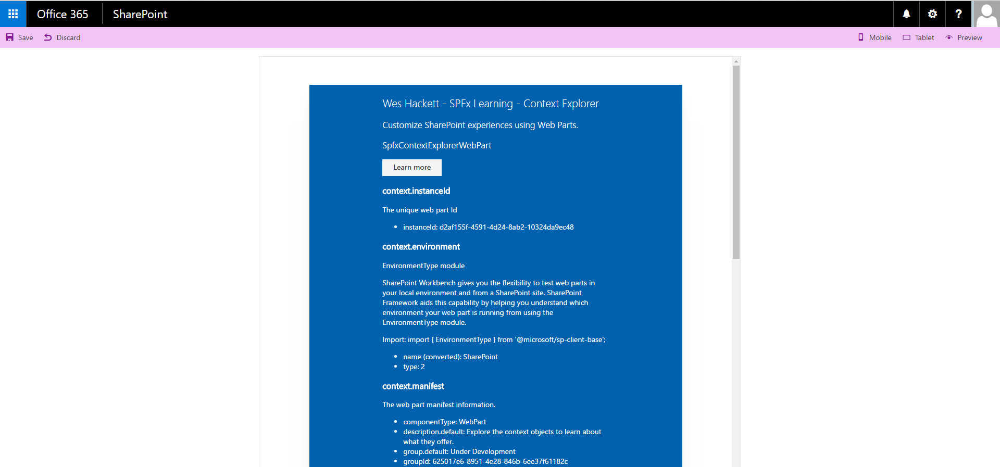
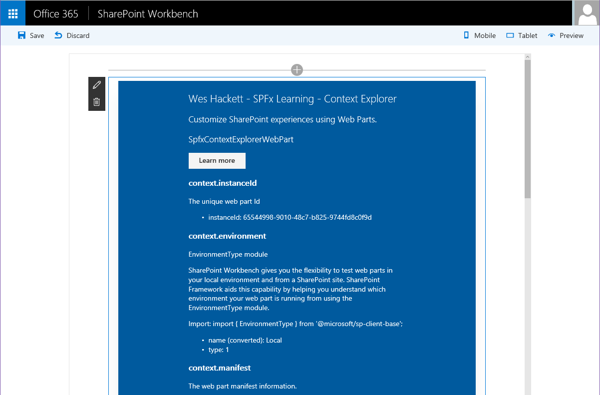

# spfx-contextexplorer-webpart

Wes Hackett - SPFx Context Explorer

## Overview

The SharePoint Framework (SPFx) comes with a context object. This web part example displays the various properties from that object.

It is useful when you want to check what values can be between workbench/classic/SharePoint pages to help you build the correct logic into the web part.

## Pre-reqs

* Developer Office 365 tenant
* Followed the instructions for getting started with SPFx here: [https://github.com/SharePoint/sp-dev-docs/wiki/Setup-SharePoint-Tenant](https://github.com/SharePoint/sp-dev-docs/wiki/Setup-SharePoint-Tenant)

## Hosted in workbench

## Hosted in SharePoint Online workbench

